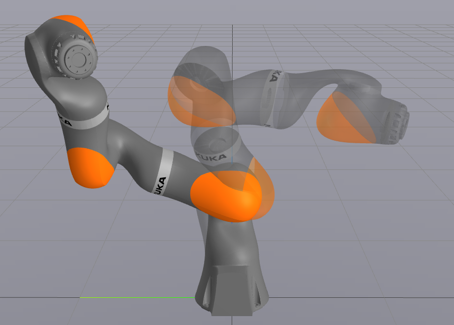
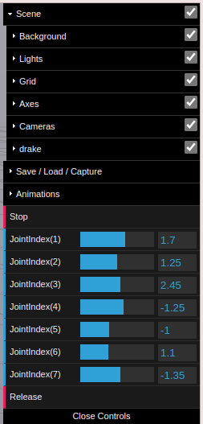
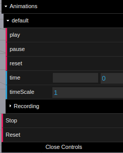

# Visualization of the motions of a manipulator under your controller

This repo presents a demo to visualize the motions of a manipulator under your controller.
To start with, one can run the [main.py](main.py) script to see the performance of the network controller we've trained.

You will see the following robots in a webpage:

together with a panel to interact with:

One can adjust every joint of the robot by dragging the sliders.
Once the `Release` button is clicked, the robot will be released and the controller will take over.

You can replay the motion as shown in the following updated panel:

Click the `Reset` with a capital R button to reset the robot and try other initial positions.

When you are done, click the `Stop` button exit the app.
